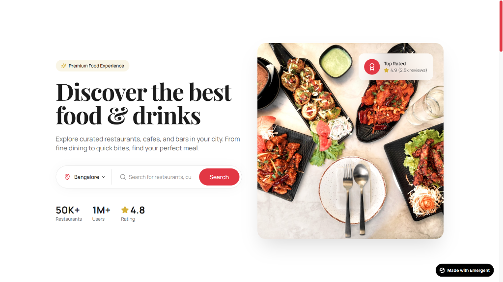
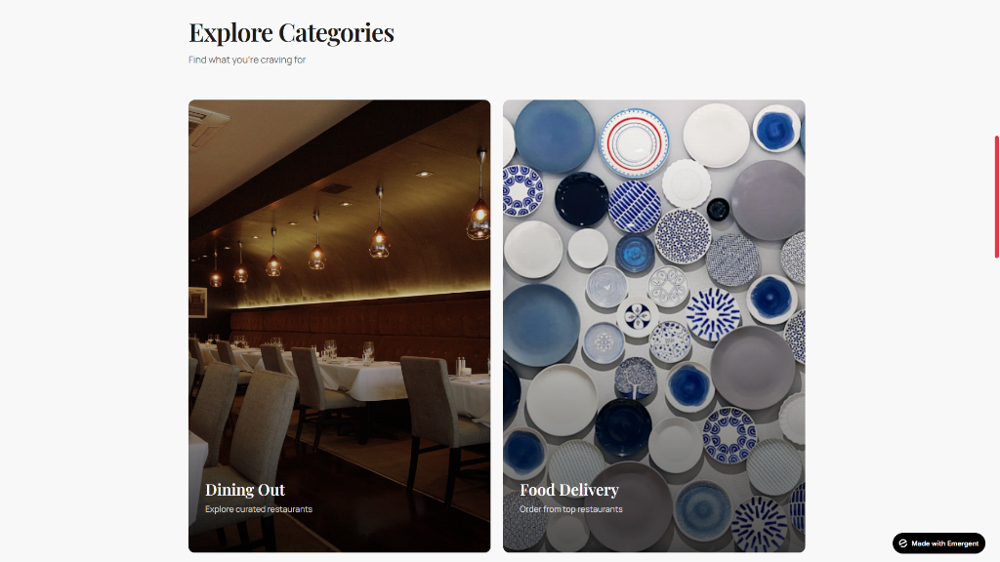
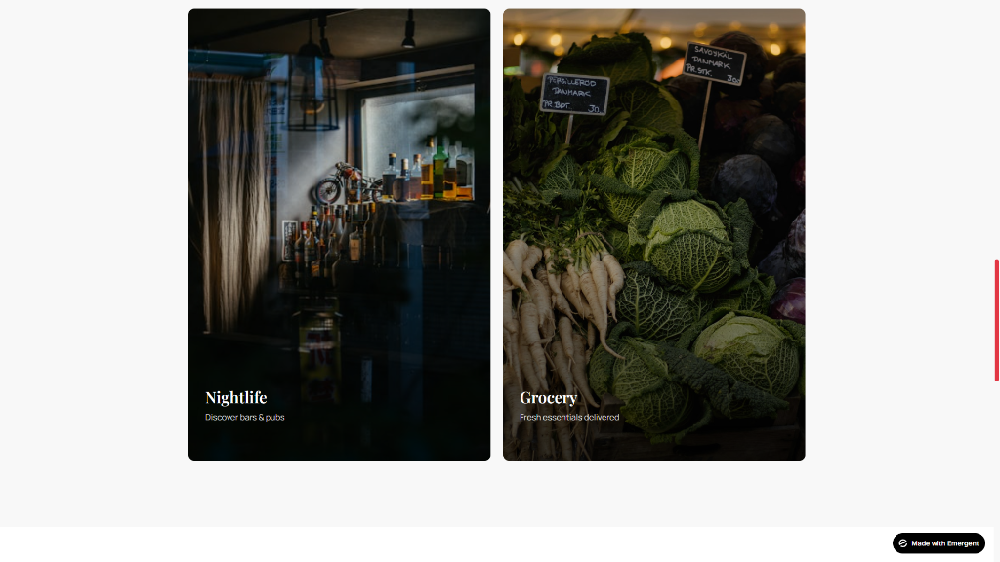
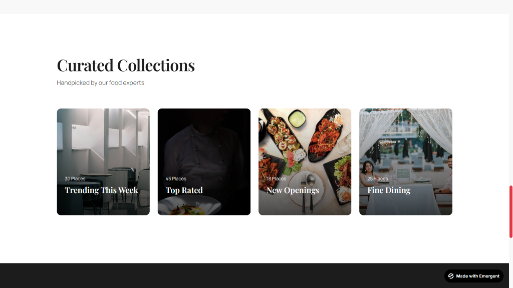
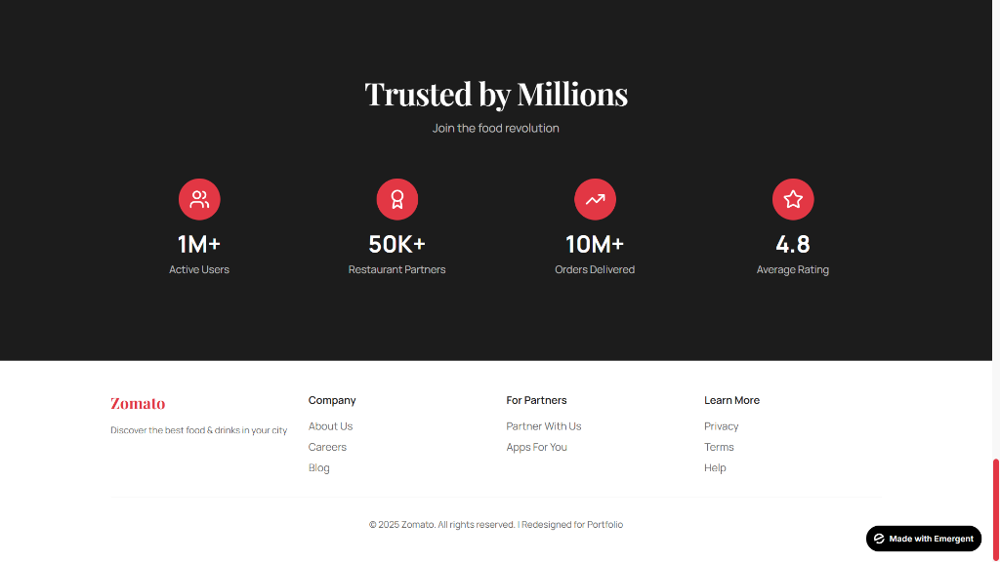

# Zomato UI Redesigned

A high-fidelity redesign of the Zomato landing page using React and Vite, featuring a premium modern aesthetic.

## Live Preview
[View Live Demo](https://culinary-elegance-5.preview.emergentagent.com/)

## Design Screenshots
The following designs were used as reference/inspiration for this project:







## Tech Stack
- React
- Vite
- Vanilla CSS (Variables & Flex/Grid)
- React Icons
- Google Fonts (Outfit & Inter)

## Getting Started

1. Clone the repository
2. Install dependencies:
   ```bash
   npm install
   ```
3. Run the development server:
   ```bash
   npm run dev
   ```
